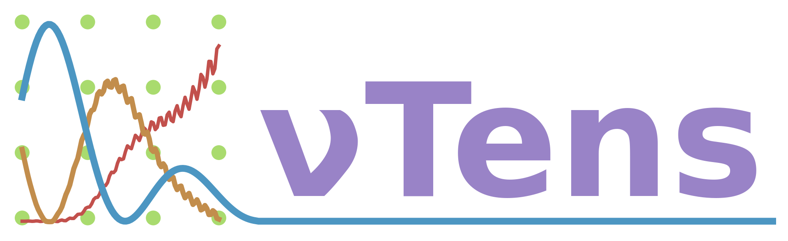

<a name="nutens"></a>
# nuTens  



nuTens is a software library which uses [tensors](https://en.wikipedia.org/wiki/Tensor_(machine_learning)) to efficiently calculate neutrino oscillation probabilities. 

[](https://github.com/ewanwm/nuTens/actions/workflows/CI-build-and-test.yml)
[](https://ewanwm.github.io/nuTens/index.html)
[](https://codecov.io/github/ewanwm/nuTens)
[](https://github.com/ewanwm/nuTens/actions/workflows/cpp-linter.yaml)


## Installation
### Requirements

- CMake - Should work with most modern versions. If you wish to use precompiled headers to speed up build times you will need CMake > 3.16.
- Compiler with support for c++17 standard - Tested with gcc
- [PyTorch](https://pytorch.org/) - The recommended way to install is using PyTorch_requirements.txt:
```
  pip install -r PyTorch_requirements.txt
```
(or see [PyTorch installation instructions](https://pytorch.org/get-started/locally/) for instructions on how to build yourself)

### Installation
Assuming PyTorch was built using pip, [nuTens](#nutens) can be built using
```
mkdir build
cd build
cmake -DCMAKE_PREFIX_PATH=`python3 -c 'import torch;print(torch.utils.cmake_prefix_path)'`
make <-j Njobs>
```

(installation with a non-pip install of PyTorch have not been tested but should be possible)

### Verifying Installation
Once [nuTens](#nutens) has been built, you can verify your installation by running
```
make test
```

## Benchmarking
nuTens uses [Googles benchmark library](https://github.com/google/benchmark) to perform benchmarking and tracks the results uing [Bencher](https://bencher.dev). Each benchmark consists of calculating neutrino oscillations for 1024 batches of 1024 neutrino energies using the standard PMNS formalism in vacuum and in constant density matter:

<p align="center">
<a href="https://bencher.dev/perf/nutens?key=true&reports_per_page=4&branches_per_page=8&testbeds_per_page=8&benchmarks_per_page=8&plots_per_page=8&reports_page=1&branches_page=1&testbeds_page=1&benchmarks_page=1&plots_page=1&branches=5047790b-f661-476d-855c-2b0fdec44d41&testbeds=11ead677-281d-4ae2-9a13-95e7c86da045&benchmarks=f15bec4b-f28e-4cd3-90ae-c3bb3a1f91f8%2Ca422e3a6-df10-448d-848f-d91b364e5904%2Cbc8283a0-f9ab-452b-b496-db8925cd9f53%2C63a00c8d-d86a-452d-ad4a-e2d8e4e3dde8%2C9ff50688-8fea-42b3-bdd7-94a041737c2e&measures=fc8c0fd1-3b41-4ce7-826c-74843c2ea71c&start_time=1720037681000&end_time=1722629908000&clear=true&tab=branches">
</a>
</p>


## Feature Wishlist
- [x] Support PyTorch in tensor library
- [x] Vacuum oscillation calculations
- [x] Constant matter density propagation
- [x] Basic test suite
- [x] Basic CI
- [x] Doxygen documentation with automatic deployment
- [x] Add test coverage checks into CI
- [x] Integrate linting ( [cpp-linter](https://github.com/cpp-linter)? )
- [x] Add instrumentation library for benchmarking and profiling
- [x] Add suite of benchmarking tests
- [x] Integrate benchmarks into CI ( maybe use [hyperfine](https://github.com/sharkdp/hyperfine) and [bencher](https://bencher.dev/) for this? )
- [ ] Add proper unit tests
- [ ] Expand CI to include more platforms
- [ ] Add support for modules (see [PyTorch doc](https://pytorch.org/cppdocs/api/classtorch_1_1nn_1_1_module.html))
- [ ] Propagation in variable matter density
- [ ] Add support for Tensorflow backend
- [ ] Add python interface 

